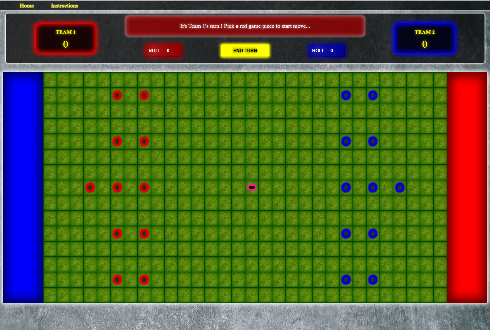
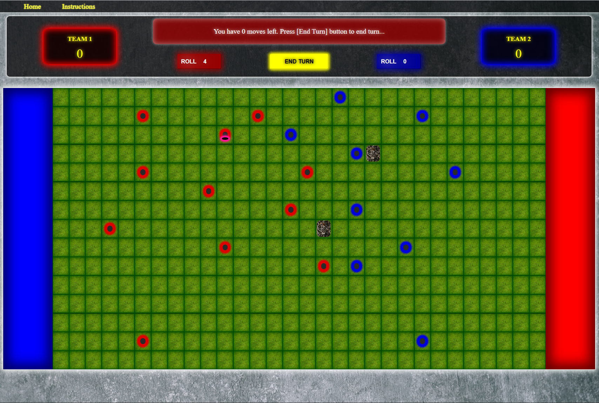
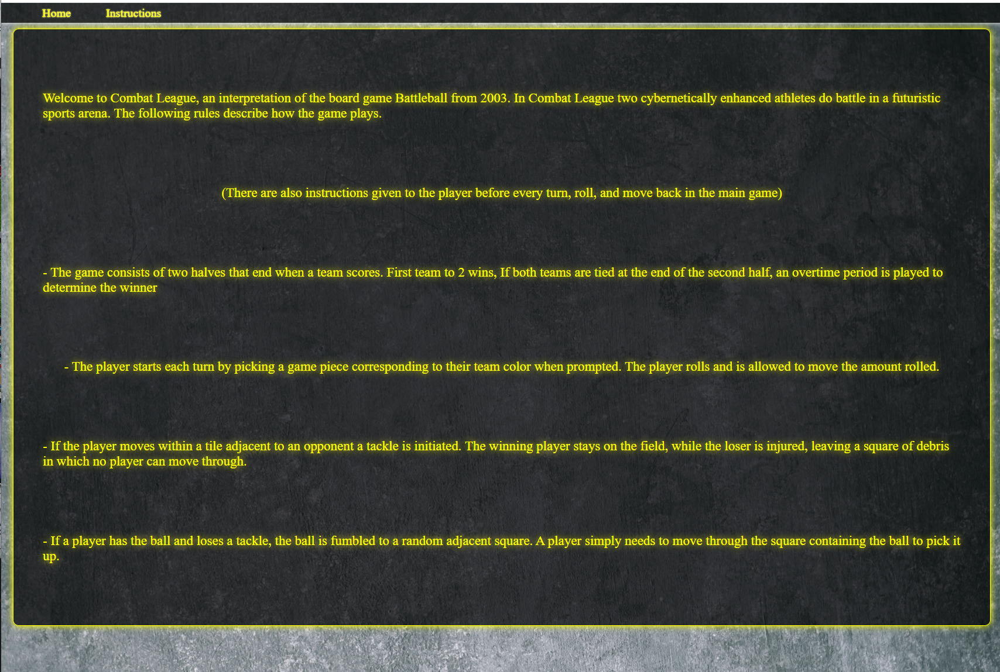

# Combat League

## Date: 08/13/2021

### By: Luke Foster

#### [GitHub](https://github.com/lfoster1150) | [LinkedIn](https://www.linkedin.com/in/luke-foster-61a31782/)

---

### **_Description_**

A web app interpretation of an underrated futuristic football strategy board game **_Battleball_** from the early 2000s. The project was originally created in four days as part of the General Assembly SEI program in order to test and showcase skills in HTML, CSS, and Javascript.

---

### **_Technologies Used_**

- HTML
- CSS
- Javascript
- Surge

---

### **_Getting Started_**

Just follow the link below, grab a friend, and have fun! Instructions for the game can be found in the _Instructions_ section of the site. Additionally, instructions are given at the top of the scoreboard before each play.

the project was deployed using Surge and can be viewed [here](combat-league.surge.sh).

The Trello board used to plan and this project and track development can be viewed [here](https://trello.com/b/IUpE8Hr9/combatleaguejs).

---

### **_Screen Shots_**

### Pre-game

#

### Action Shot

#

### Instructions Page

##

### **_Future Updates_**

- [ ] Structure and functionality at bottom of page including injury list and restart game button.
- [ ] Basic CPU opponent
- [ ] Add classes that have varrying dice sizes, positions, names, and functionality.
- [ ] Use a public API to randomly generate names.

### **_Credits_**

##### Original Game Info: [BGG](https://boardgamegeek.com/boardgame/6795/battleball)

##### Keyboard Events Info: [tutorialspoint](https://www.tutorialspoint.com/how-to-trigger-a-button-click-on-keyboard-enter-with-javascript)

##### Neon Info: [CSS-Tricks](https://css-tricks.com/how-to-create-neon-text-with-css/) | [CodePen By Kevin](https://codepen.io/kevinpowell/pen/QWdRzON)

##### Pictures/Textures Info: [Metal](https://unsplash.com/s/photos/metal) | [Grass](https://freestocktextures.com/search/?q=grass) | [Futuristic City](https://unsplash.com/s/photos/future-city) | [Junk](https://unsplash.com/s/photos/junk) | [Concrete](https://freestocktextures.com/search/?q=concrete)

##### Adds screenshot to Linkedin link: [Medium](https://medium.com/@jamesyhiggs/how-to-add-thumbnail-images-to-the-featured-section-of-your-linkedin-profile-for-web-apps-sites-917346235932)

##### HTML Info: [WS3](https://www.w3schools.com/html/default.asp)

##### CSS Info: [WS3](https://www.w3schools.com/css/default.asp)

##### JS Info: [MDN](https://developer.mozilla.org/en-US/docs/Web/JavaScript)
